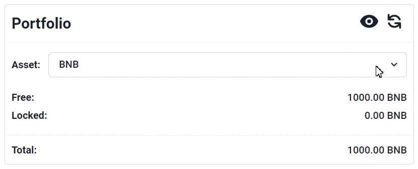
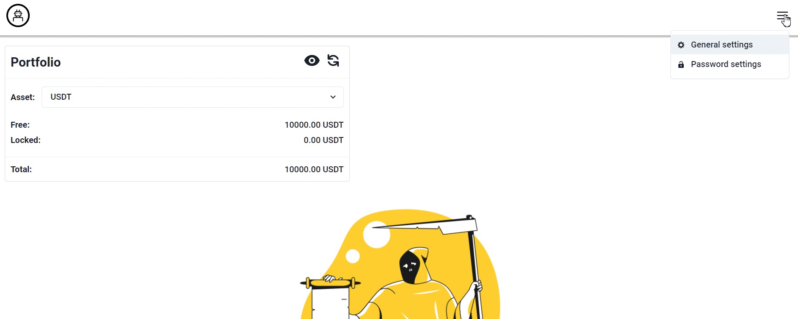
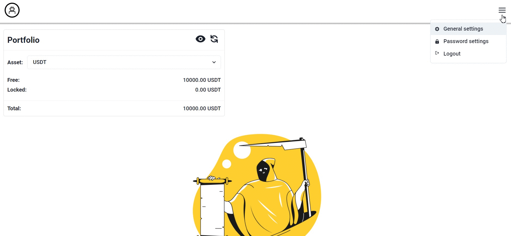
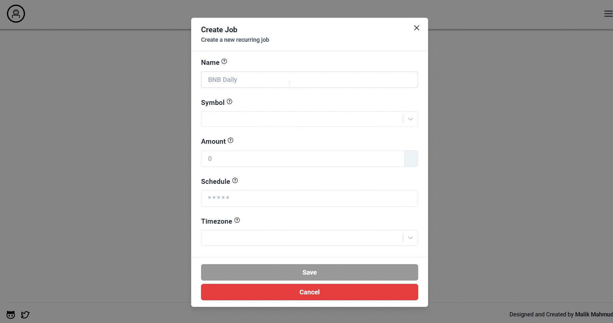
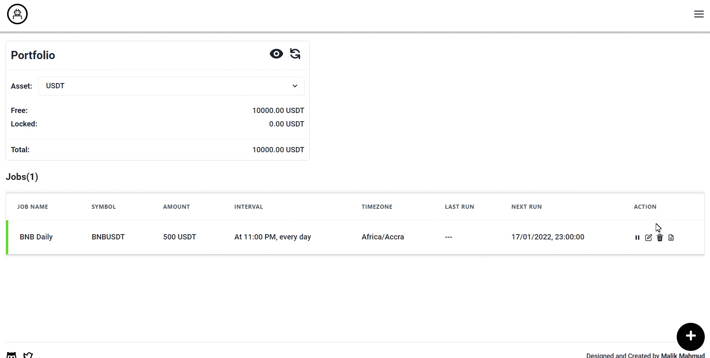
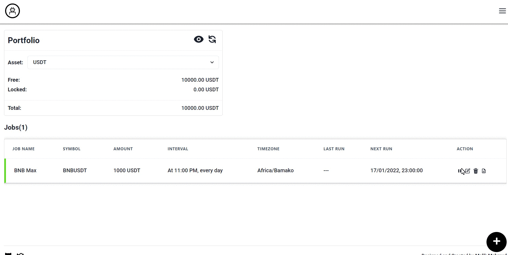
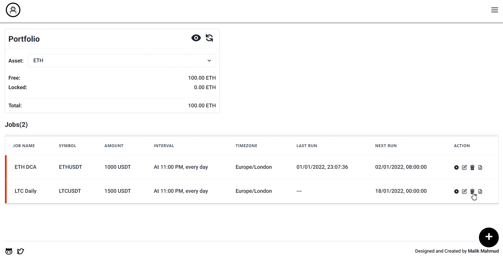
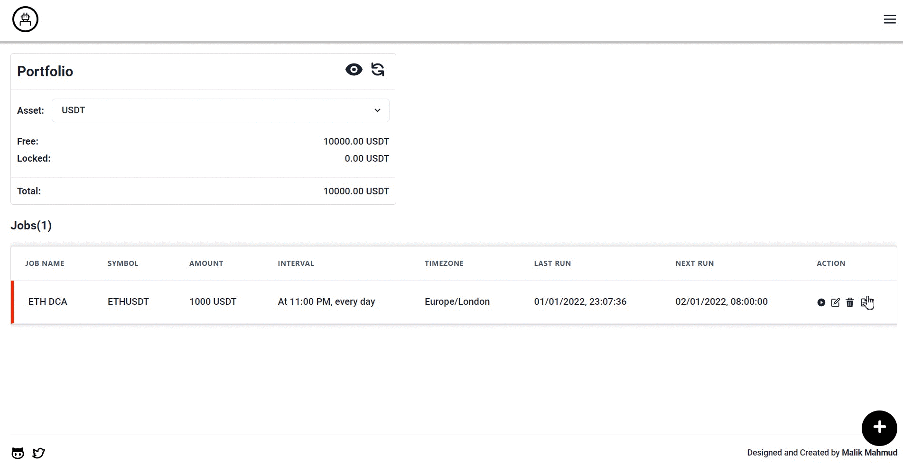
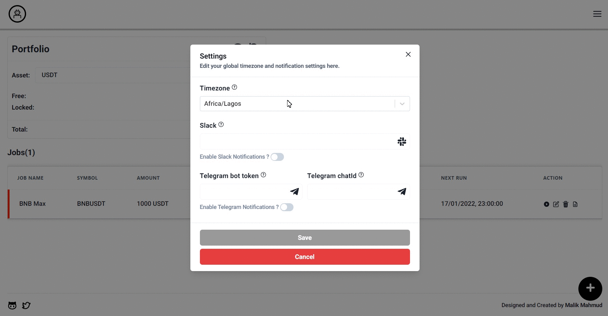

<div align="center">
  
  <h3 align="center">binance-dca-bot</h3>
  <p>A dollar cost averaging bot for the Binance Cryptocurrency Exchange.</p>
</div>

## About

This bot allows you to schedule recurring buy orders for any trading pair available on the Binance cryptocurrency exchange.

What is dollar cost averaging? [Dollar cost averaging DCA](https://academy.binance.com/en/glossary/dollar-cost-averaging) refers to the practice of investing fixed amounts at regular intervals (for instance, $20 every week). This is a strategy used by investors that wish to reduce the influence of volatility over their investment and, therefore, reduce their risk exposure.

## Getting Started

### Prerequisites

- NodeJs [v14](https://nodejs.org/en/download/releases/)

### Installation

1. Get your Binance API keys. You can learn how to from this [tutorial](https://www.binance.com/en/support/faq/360002502072)
2. Clone the repo

   ```sh
   git clone https://github.com/MlkMahmud/binance-dca-bot.git
   ```

3. Install dependencies
   ```sh
   cd binance-dca-bot
   npm install
   ```

### Configure environment varibles

| Environment Key         | Description                                                                                                                                                                                                                                                                             | Sample Value                                                                                 | Required |
| ----------------------- | --------------------------------------------------------------------------------------------------------------------------------------------------------------------------------------------------------------------------------------------------------------------------------------- | -------------------------------------------------------------------------------------------- | -------- |
| BINANCE_API_KEY         | Binance API key                                                                                                                                                                                                                                                                         | from [Binance](https://www.binance.com/en/support/faq/360002502072) | True     |
| BINANCE_API_SECRET      | Binance API secret                                                                                                                                                                                                                                                                      | from [Binance](https://www.binance.com/en/support/faq/360002502072) | True     |
| BINANCE_TESTNET_ENABLED | Enable/Disable Binance test mode (defaults to true). You must explicitly set this value to false if you want to run the bot in live mode                                                                                                                                                | true/false                                                                                   | False    |
| DB_URL                  | A valid MongoDB connection string. [Learn more](https://docs.mongodb.com/manual/reference/connection-string/)                                                                                                                                                                           | mongodb://mongodb0.example.com:27017                                                         | True     |
| JWT_SECRET              | A string or buffer containing either the secret for HMAC algorithms, or the PEM encoded public key for RSA and ECDSA                                                                                                                                                                    | helloiamasecretkey                                                                           | True     |
| PORT                    | The port you want your server to listen on                                                                                                                                                                                                                                              | 3000                                                                                         | False    |
| SENTRY_AUTH_TOKEN       | The authentication token to use for all communication with Sentry.                                                                                                                                                                                                                      | from [Sentry](https://docs.sentry.io/product/cli/configuration/#to-authenticate-manually)    | False    |
| SENTRY_DSN              | The Data Source Name (DSN) to use to connect to Sentry                                                                                                                                                                                                                                  | from [Sentry](https://docs.sentry.io/product/sentry-basics/dsn-explainer/)                   | False    |
| SENTRY_ENABLED          | Enable/Disable Sentry                                                                                                                                                                                                                                                                   | true                                                                                         | False    |
| SENTRY_RELEASE          | A release is a version of your code deployed to an environment. When you notify Sentry about a release, you can easily identify new issues, regressions, whether an issue is resolved in the next release, and apply source maps. [Learn more](https://docs.sentry.io/product/releases) | v0.0.1                                                                                       |False
| SENTRY_ORG              | The slug of the organization to use for a command                                                                                                                                                                                                                                       | from [Sentry](https://docs.sentry.io/product/cli/configuration/#to-authenticate-manually)    | False    |
| SENTRY_PROJECT          | The slug of the project to use for a command.                                                                                                                                                                                                                                           | from [Sentry](https://docs.sentry.io/product/cli/configuration/#to-authenticate-manually)    | False    |
| SLACK_ENABLED           | Enable/Disable Slack notifications                                                                                                                                                                                                                                                      | true                                                                                         | False    |  | False |
| SLACK_WEBHOOK_URL       | Your Slack webhook URL                                                                                                                                                                                                                                                                  | from [Slack](https://api.slack.com/messaging/webhooks)                                       | False    |
| TELEGRAM_ENABLED        | Enable/Disable Telegram notifications                                                                                                                                                                                                                                                   | true                                                                                         | False    |
| TELEGRAM_BOT_TOKEN      | Authentication token for your Telegram Bot                                                                                                                                                                                                                                              | from [Telegram](https://dev.to/rizkyrajitha/get-notifications-with-telegram-bot-537l)        | False    |
| TELEGRAM_CHAT_ID        | The ID for your Telegram Group/Channel                                                                                                                                                                                                                                                  | from [Telegram](https://dev.to/rizkyrajitha/get-notifications-with-telegram-bot-537l)        | False    |
| TIMEZONE                | The default timezone to use for the job scheduler **(must be moment compatible)**                                                                                                                                                                                                       | Africa/Lagos                                                                                 | False    |

### Run the bot

To start the bot in **developement mode** run

```sh
npm run dev
```

**N.B. This command loads environment variables from the .env, if it exists**

To start the bot in **production mode** run

```sh
npm run build
npm start
```

**N.B. This command does not load env variables from the .env file, even if it exists.**

## Deployment

There are no strong constraints regarding deployments. The bot is a [Next.js](https://nextjs.org) application powered by a custom Express server, so there are a myriad of options to choose from. I personally host my mine on an [Azure Virtual Machine](https://docs.microsoft.com/en-us/azure/virtual-machines/) and I automate my deployments using GitHub Actions. If you choose to go in a different route, feel free to delete the [prod-deploy](./.github/workflows/prod-deploy.yml) and [bump-version](./.github/workflows/bump-version.yml) workflow files.

Some of my personal favourite options for deployment:
- [Render](https://render.com/docs/deploy-node-express-app)
- [Heroku](https://devcenter.heroku.com/articles/deploying-nodejs)


## Features
### Portfolio
View up to date balance of all assets in your portfolio



### Authentication
Enable password




Update password


Disable password




### Jobs
Create a new job



Edit an existing Job




Pause/Resume a Job




Delete a job



View Job order history




### Notifications
Enable Slack  and Telegram Notifications




## Todo
- [x] Fix: unpausing a job causes the job to run immediately, instead of waiting for next scheduled interval.


## Built with
- [Express.js](https://expressjs.com/)
- [Next.js](https://nextjs.org/)
- [React](https://reactjs.org/)
- [MongoDB](https://www.mongodb.com/)
- [Agenda](https://www.npmjs.com/package/agenda)
- [Chakra UI](https://chakra-ui.com/)

## Disclaimer

Please, use at your own discretion. I will not be liable for any losses or hardship incurred from using this bot. ✌

## License

Distributed under the MIT License. See [LICENSE](LICENSE) for more information.
